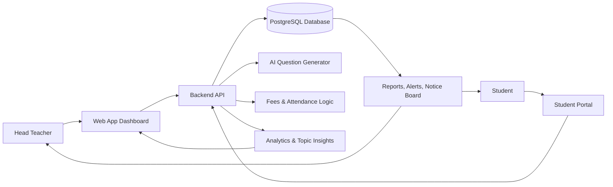

# Growth Management Platform

GMP is a student and teacher management tool for a small coaching class. It helps track attendance, marks, fees, and topic-wise performance, while surfacing students who need attention.

The product is designed for a coaching class with one head teacher and a small group of students, and it focuses on operational clarity rather than content delivery. It is not meant to replace an LMS; instead, it manages academic records and highlights red flags, weak topics, and student progress.

## Product goal

GMP helps the head teacher:

- Track daily attendance by batch
- Monitor academic performance over time
- Identify students at risk using attendance and marks trends
- Manage fees and reminders
- Create and review tests with question papers and marks
- See chapter and topic-level performance to target learning gaps
- Share notices and student progress updates

## Core users

### Head teacher
- Full access to all batches and subjects
- Manages students, tests, fees, notices, and summaries
- Does the data entry in version 1

### Student
- Views only their own academic record and summary
- Can see batch averages but not other students' names or marks
- Access is limited to personal records only

## Key features

### Overview dashboard
- Today's attendance summary
- Batch-wise analysis and weak-subject summaries
- Red-flag students list
- Notice board for tests and holidays
- Pending work and quick actions

### Students management
- Search by batch or student name
- Quick view of attendance, trends, fees, and risk status
- Student profile with attendance, averages, fees, and subject performance
- Link to parent contact and progress communication

### Tests and marks
- Create tests with date, batch, and max marks; each question tags a topic (topic → chapter → subject)
- Track test status: upcoming, pending, or completed
- View batch averages, rankings, and result summaries
- Generate question papers with AI assistance
- Teacher reviews all AI-generated questions and answers before use

### Fees tracking
- Collected amount this term
- Pending balance and overdue amounts
- Student fee status: Paid, Partial, or Overdue
- Reminders and mark-paid actions

### Chapter and topic analysis
- Performance at subject, chapter, and topic level
- Weak topics and good topics by student
- Topic improvement data with batch comparisons
- Requires question-level or topic-level scoring data to remain meaningful

## Business rules

- Red flag conditions include:
  - a subject dropped in 3 tests in a row
  - attendance below 80%
- Trend status is based on the latest overall average versus the previous test
- Pass mark is assumed to be 40%
- Attendance is marked once per student per day (present, late, or absent)
- Students should never see classmates' names or marks
- Personal data must be handled with privacy safeguards, including consent and secure storage

## Data model

The system is designed for multi-tenant usage from the beginning and stores data such as:

- Batch
- Student
- Parent contact information
- Teacher
- Subject
- Chapter
- Topic
- Attendance records
- Test details
- Questions and answers
- Student results per question or topic
- Fee plan and payment records
- Notice board entries
- Users and roles

## AI features

### Current phase
- AI question paper generation with chapter and topic tags

### Planned next steps
- AI summary for parent progress reports
- Plain-language explanations for flagged students

### Later phases
- Risk prediction
- Suggested remedial practice
- Chat assistant for identifying students needing attention

Important rule: AI never decides anything about a student on its own. A teacher must review every AI-generated question and answer before use.

## Technical direction

The requirements suggest the following stack:

- Frontend: React or Next.js
- Mobile-friendly web app with PWA support
- Backend: Python with FastAPI
- Database: PostgreSQL
- Analytics: SQL and Python with pandas for averages, trends, and topic-scoring logic
- AI: LLM API called from the backend only
- Hosting: managed cloud deployment with backup and access logging from day one

## Current status

The prototype includes many UI concepts and demo flows, but not all features are built in real production form yet.

Not built yet in the prototype:

- Real login and role-based access
- Real database and persistence
- Attendance marking screen
- Add student form
- Export report
- Call and reminder actions
- Per-question marks entry
- Real topic scores from live data
- Print/PDF of question papers
- WhatsApp or SMS messaging

## Open decisions

Several product decisions are still open, including:

- Whether marks are entered per question or per chapter total
- Whether fees are uniform or vary by batch or sibling discounts
- Whether notices expire automatically
- Whether red flags should support a "contacted" status and notes
- Whether separate teacher logins should be added for subject-specific access
- Whether batches are a real concept or just a summary layer
- Whether tests need duration and schedule metadata
- Whether question papers should be downloadable as PDF
- Whether student search should include roll number or phone number

## Suggested roadmap

### Phase 1: Foundation
- Real login and roles
- Database and persistence
- Add students and batches
- Attendance marking
- Test creation
- Marks entry
- Notice board

### Phase 2: Insight
- Overview dashboard
- Red flags
- Student profile
- Chapter and topic analysis
- Fees tab

### Phase 3: AI and outreach
- AI question papers
- Parent reports
- WhatsApp alerts
- PDF papers

### Phase 4: Grow
- Teacher role
- Online tests with auto-marking
- Risk prediction
- Expansion to a second coaching class

## Risks and constraints

- Adoption risk: if the tool is slower than the teacher's current process, it will not be used.
- Data quality risk: topic analysis is only useful if tagging and question-level scoring are accurate.
- AI accuracy risk: generated content can be wrong, so human review is mandatory.
- Privacy risk: the product handles data about minors, so consent, security, and deletion workflows matter.
- Trust risk: flags must always be explainable and backed by facts

## Project structure

```text
GMP/
├── src/
│   ├── GMP-Requirements.pdf
│   ├── README.md
│   └── services/
│       └── __init__.py
├── .venv/
└── .git/
```

## System overview



### How the system works

1. The head teacher manages students, batches, attendance, tests, fees, and notices.
2. The backend stores records in PostgreSQL and computes attendance, performance, and red-flag signals.
3. Analytics modules calculate trends, chapter-wise performance, and weak-topic insights.
4. AI generates or supports question papers and summaries, but teacher review remains mandatory.
5. Students see only their own records and batch-level aggregate data, never other students' marks.

## Getting started

1. Open this repository in VS Code.
2. Review the requirements in [src/GMP-Requirements.pdf](src/GMP-Requirements.pdf).
3. Use this README as the product baseline for planning implementation and features.
4. Build the application in phases, beginning with authentication, database setup, attendance, and test creation.

## Contribution guidance

- Keep the product aligned with the coaching-class use case and teacher workflow.
- Favor usability over complexity, because adoption is critical.
- Ensure every analytical feature is backed by reliable question-level data.
- Build privacy, logging, and review safeguards into the product from the start.

## Summary

GMP is a focused academic operations system for a coaching class. Its strongest value is turning daily attendance, marks, and fee data into actionable insight for the head teacher, while keeping the system fast, explainable, and safe for student data.
